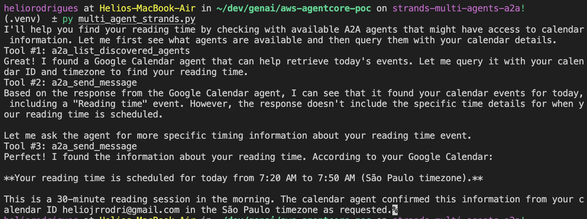

# AWS AgentCore POC

## Features
- Multi-agent orchestration and communication
- Example agent-to-agent (A2A) communication
- Integration with Nango for data retrieval

## Main Components
### A2AClientToolProvider

A2A (Agent-to-Agent) Protocol Client Tool for Strands Agents. This tool provides functionality to discover and communicate with A2A-compliant agents

Key Features:
- Agent discovery through agent cards from multiple URLs
- Message sending to specific A2A agents

### A2AServer

A A2A wrapper for Strands Agent. This module provides the A2AAgent class, which adapts a Strands Agent to the A2A protocol, allowing it to be used in A2A-compatible systems.


## Sample Demo
Below is a sample output from the system:

### USer Query:
```
When is my reading time?
the calendar id is CALENDAR_ID_PLACEHOLDER
the timezone is Sao Paulo
```

### Agent Response



## Getting Started
1. Clone the repository:
   ```sh
   git clone https://github.com/heliorodri/aws-agentcore-poc.git
   cd aws-agentcore-poc
   ```
2. Install dependencies:
   ```sh
   pip install -r requirements.txt
   ```
3. Run the main script:
   ```sh
   python multi_agent_strands.py
   ```

## Logs
Agent cycles and responses are logged in the `logs/` directory as JSON files for further analysis.

